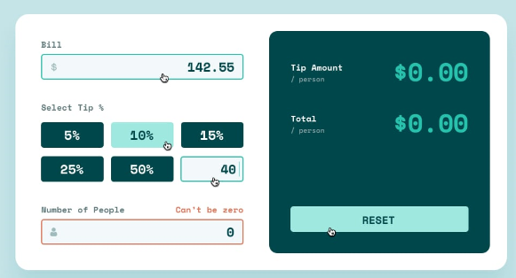

# Webpack Workflow 2021


<p align="center">
  
</p>

### Built With

<!-- This section should list any major frameworks that you built your project using. Here are a few examples.-->


- [Pug](https://pugjs.org/api/getting-started.html)
- [Sass](https://sass-lang.com/)
- [postcss](https://postcss.org/)
- [Webpack](https://webpack.js.org/)
- [babel](https://babeljs.io/)


## How To Use

```bash
# Clone this repository
$ git clone https://github.com/cqrlosArch/webpack-workflow-2021

# Install dependencies
$ yarn install or npm install

# Run mode development
$ yarn start or npm start

# Build app
$ yarn build or npm run build
```